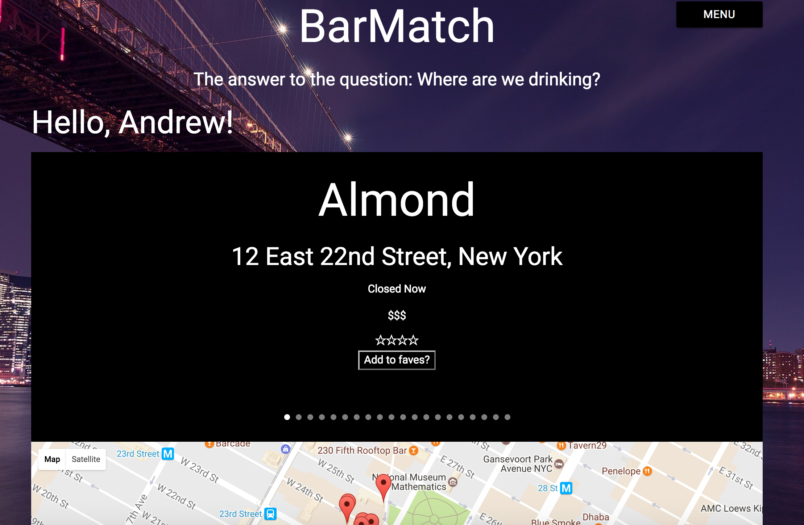

#BarMatch

BarMatch uses Google's geolocation api, places api, and an embedded Google map to grab a user's location, find bars in their area, and plot them on an interactive map. BarMatch can be easily refactored to search for an type of place from cafes to hospitals.



##Installation
1. Clone this repository.
2. In your terminal, cd into the repository.
3. Run `npm install` in your terminal cli.
4. You will have to get google geolocation and places api keys and set them to environment variables 
5. Then run `npmrun dev` and visit localhost:3000

##Technologies
* Express
* Node.js
* REST apis
* SASS

##Code example
```javascript```
router.post('/', function(req, res, next) {
  console.log(req.body.user_id)
  models.User_Bars.create({
    user_id: req.body.user_id,
    bar_name: req.body.bar_name,
    bar_address: req.body.bar_address
  }).then(function() {
    res.redirect('/user');
  });
});
```
This is an example of adding a bar to a user's favorites list. Here I make a post request to PostgreSQL table calles user bars and include the user id for reference when getting a user's favorites list to render.

###Author
Andrew Dallas